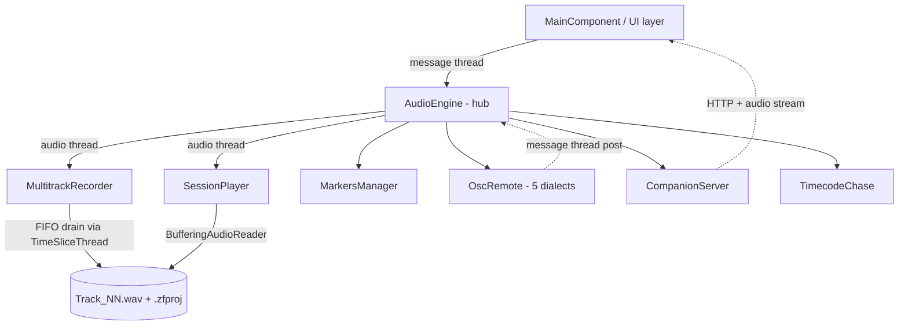
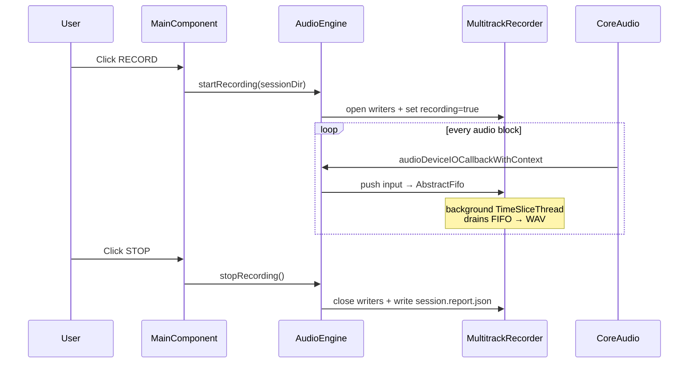

# Architecture — ZynForge Recording

## 1. Overview

ZynForge Recording is a JUCE 8 / C++20 macOS application for live multitrack recording and virtual-soundcheck playback. It captures every input channel on a front-of-house console to disk in real time, then plays those tracks back through the same outputs during a soundcheck — letting an engineer dial in the room without the band on stage.

It is **not** a mixer or DAW. No plugins, no effects, no talkback. Architectural emphasis is on real-time safety, crash-survivability of capture files, and identical state across the MIXER / EDIT / PATCH views.

## 2. Technology Stack

| Component | Version / Notes |
|---|---|
| Language | C++20 |
| Framework | JUCE 8.0.4 (pulled via CMake `FetchContent` on first configure) |
| Build system | CMake 3.21+, Xcode generator on macOS |
| Platforms | macOS 11.0+, Universal (arm64 + x86_64) |
| Audio backend | CoreAudio via `juce::AudioDeviceManager` |
| Threading | `juce::AudioWorkgroup` for writer co-scheduling on Apple Silicon |
| GPU / paint | JUCE software renderer; Apple Accelerate / vDSP for FFTs |
| Network | Embedded HTTP server (`juce::StreamingSocket`); NDI via runtime `dlopen` |
| Persistence | `juce::PropertiesFile` (app prefs) + `.zfproj` JSON (per-session) |
| Bundled fonts | Inter (UI), JetBrains Mono (tabular numerals) via `BinaryData` |
| External tools | `lame` (MP3 export, ChildProcess), `rclone` / `aws` / `rsync` (cloud upload) |

## 3. High-Level Architecture



The hub is `AudioEngine`. It owns `juce::AudioDeviceManager`, registers as the `AudioIODeviceCallback`, and on each audio block:

1. Clears outputs
2. Runs `MultitrackRecorder::processBlock` (input → ring buffers)
3. Runs `SessionPlayer::processBlock` into a per-track scratch buffer
4. Applies mute / solo / VCA / aux-send routing into a 64-bit accumulator (`juce::AudioBuffer<double>`)
5. Downcasts and writes to outputs, the stream bus, the optional `StereoMix.wav` writer, and the companion audio ring
6. Drives meters and the FFT FIFO from the in-flight buffers
7. Steps soft-takeover ramps for cue recall

## 4. Directory Structure

```
ZynforgeRecording/
├── CMakeLists.txt
├── CLAUDE.md / README.md / architecture.md / design.md
│   tasks.md / decisions.md / coding-standards.md / testing.md / CHANGELOG.md
├── Source/
│   ├── Main.cpp                       — JUCE app entry + window
│   ├── Audio/                         — real-time + persistence layer
│   │   ├── AudioEngine.{h,cpp}        — hub; AudioIODeviceCallback
│   │   ├── MultitrackRecorder.{h,cpp} — input → AbstractFifo → background WAV writer
│   │   ├── SessionPlayer.{h,cpp}      — clip-aware playback via BufferingAudioReader
│   │   ├── TrackState.h               — per-track atomics (peak, RMS, armed, mute, gain, …)
│   │   ├── EngineStatus.h            — serialisable status snapshot (capture-split Phase 0 boundary)
│   │   ├── Markers.{h,cpp}            — per-session marker store
│   │   ├── TimecodeChase.h            — LTC bit decoder + MTC quarter-frame accumulator
│   │   ├── StripColours / StripNames / StripGains / StripRouting  — appProps overrides
│   │   ├── FastAccumulate.h           — NEON helpers for 64-bit summing on arm64
│   │   ├── NoiseAnalyzer.h            — post-record FFT heuristic
│   │   ├── QcAnalyzer.h               — post-show per-track QC (peak/LUFS/clips/floor), streamed
│   │   ├── SongDetector.h            — multi-track quorum song-boundary scan → markers
│   │   ├── PreflightProbes.h         — measured disk-speed / writability / headroom probes
│   │   ├── TransientDetector.h        — onset detection (chunked file read)
│   │   └── CrashReportScan.h          — launch-time .ips telemetry (find/summarize)
│   ├── UI/                            — message-thread paint code
│   │   ├── MainComponent.{h,cpp}      — root, menu bar, layout, 24 Hz refresh timer
│   │   ├── ChannelStrip.{h,cpp}       — one logical strip (mixer view)
│   │   ├── EditPage.{h,cpp}           — clip / waveform editor
│   │   ├── PatchPage.{h,cpp}          — input / output routing matrix
│   │   ├── VcaPanel.h                 — 8 VCA mini-strips
│   │   ├── SetlistBar.{h,cpp}         — cue list + jump controls (path-drawn arrows)
│   │   ├── BigClockPanel.{h,cpp}      — hero timer + disk-health banner with pulse
│   │   ├── TransportBar.{h,cpp}       — play / stop / record (path-drawn icons)
│   │   ├── Toast.h                    — non-modal feedback pill
│   │   └── *Dialog.{h,cpp}            — modal prompts (all use DialogChrome)
│   ├── Theme/                         — design system
│   │   ├── BrandColors.h              — palette, personality, accents, shadow, onSignal
│   │   ├── BrandTokens.h              — type scale, spacing, radius
│   │   ├── DialogChrome.h             — unified modal chrome helpers
│   │   └── ZynForgeLookAndFeel.{h,cpp}— JUCE LookAndFeel override
│   └── Network/                       — non-audio I/O
│       ├── CompanionServer.{h,cpp}    — embedded HTTP + 48 kHz WAV audio stream
│       ├── NDIBridge.h                — runtime-loaded NDI broadcast
│       ├── OscRemote.{h,cpp}          — 5-dialect inbound console OSC parser
│       ├── ConsoleLink.{h,cpp}        — outbound console VSC (profile-based; X32 reference)
│       ├── ConsoleProfile.h           — per-console-family VSC capability profiles
│       ├── CaptureProtocol.h          — capture daemon↔GUI wire protocol (Phase 1 contract)
│       ├── CaptureLink.{h,cpp}         — capture daemon↔GUI local-socket transport (Phase 1b)
│       └── SessionMirror.{h,cpp}      — parallel session mirror to a second host
│   ├── Capture/                       — headless capture daemon (Phase 1c)
│   │   ├── CaptureDaemon.{h,cpp}      — device callback + recorder + CaptureServer engine
│   │   └── CaptureMain.cpp            — `zynforge-capture` console entry (2nd CMake target)
├── .github/workflows/ci.yml          — GitHub Actions: build + headless suite on push/PR
└── build/                             — CMake / Xcode build artefacts (gitignored)
```

## 5. Key Components and Responsibilities

### AudioEngine (`Source/Audio/AudioEngine.{h,cpp}`)
The hub. Owns `juce::AudioDeviceManager`, the recorder, the player, markers, OSC, the companion server, timecode chase, the VCA bus state (`kNumVcas = 8`), per-strip aux sends, and every persistent store. Implements `juce::AudioIODeviceCallback`. Exposes the public API for the UI: transport, routing, VCA, aux sends, takes, cue tempo curves, soft-takeover ramps.

### MultitrackRecorder (`Source/Audio/MultitrackRecorder.{h,cpp}`)
Real-time-safe input path. Per-channel `juce::AbstractFifo` ring buffer drained by a `TimeSliceThread` writing the configured `CaptureFormat` (WAV / AIFF / FLAC, 16 / 24 / 32-bit). Periodic header flush every ~5 s so a crash leaves playable files. Supports a parallel backup writer with an independent format (e.g. WAV/24 primary + FLAC/24 backup).

### SessionPlayer (`Source/Audio/SessionPlayer.{h,cpp}`)
Real-time-safe output path. Wraps `Track_NN.wav` in non-blocking `juce::BufferingAudioReader`s. Clip-aware: walks per-track clip lists, honours mute / lock / gain / fade per clip. Session swap defers the reader-vector mutation until in-flight callbacks drain.

### UI layer (`Source/UI/`)
Message-thread only. `MainComponent` runs a 24 Hz `juce::Timer` that pulls atomics off engine + tracks and repaints. Three logical views (MIXER / EDIT / PATCH) share state through the engine — view drift is a bug, not a feature.

`MainComponent.cpp` was split (2026-05-24) along functional lines: `MainComponentTimer.cpp` (refresh tick), `MainComponentKeys.cpp` (keyboard shortcuts), `MainComponentLayout.cpp` (paint + resized), `MainComponentCues.cpp` (cue + setlist + soft-takeover ramp), `MainComponentEdit.cpp` (undo / redo / cut / paste / split / range / marker / automation transaction), `MainComponentSessionIO.cpp` (save / load / export / import / template ops), `MainComponentMenu.cpp` (macOS menu surface). Same pass split `AudioEngine.cpp` into `AudioEngineAutomation.cpp` (lanes + JSON + Safe + thinning) and `AudioEngineClips.cpp` (clip edits + takes + playlists).

**macOS menu refresh (2026-06-04).** `MainComponent` is the `MenuBarModel`; macOS caches each item's enabled state until `menuItemsChanged()` is called. `MainComponentMenu.cpp::refreshMenuStateIfChanged()` polls a signature of every menu-gating condition from the 10 Hz timer and refreshes only on change — without it the menu froze in the empty launch state. The menu bar is `File · Edit · Track · Session · Help`: Edit = timeline/audio editing, the **Track** menu = channel/strip management (split 2026-06-04). All session opens (File ▸ Open, Welcome dialog, launch auto-reopen) funnel through `MainComponentSessionIO.cpp::openSessionFolder()`, which also auto-reopens the last session on launch and sizes the mixer from loaded audio when a session has no `session_mix.json`.

**EDIT view (`EditPage.cpp`).** Each clip renders as a DAW region block: a bordered block with a name header + its own waveform drawn from the clip's file region (so move/slip-trim show the right audio; the continuous thumbnail is only the no-clips fallback). The waveform is drawn at `waveZoom × clipLinearGain`, so a clip's shape scales with its gain. Each clip carries a Pro Tools-style **gain fader** in its bottom-left corner (drag mode 7: relative ride, Alt-click → 0 dB). The per-row header column (swatch / name / R-I-S-M / VIEW / slim `LedMeter` / routing) is **pinned** — drawn last via `paintHeader(g, headerOriginX())` and hit-tested through `inWavePane/inSwatch/inNameZone`, with a `ScrollViewport` that re-pins on horizontal scroll. A faint 1-2-5 s timeline grid sits behind the clips; clip Move + trim drags snap through `engine.snapSampleToGrid`. Single-key tools `S/T/R/G/F/B`; `Cmd+E` separates, `Cmd+H` heals, `E` zooms to selection. Edit-menu ops Strip Silence (slider dialog) / Heal / Consolidate map to `AudioEngineClips.cpp` methods; all clip edits are undoable through `pushClipUndo`. Mixer ops are undoable via the coalesced `pollMixerUndo` poll (see *Undo model* in `CLAUDE.md`).

**Settings dialogs.** Four dialogs cover distinct concerns:
- `SessionSettingsDialog` — editable: audio format / sample rate / bit depth. Menu label: "Session Format & Recording...".
- `SessionPropertiesDialog` — name / notes + read-only audio config summary. Menu label: "Session Info & Notes...".
- `ClickSettingsDialog` — metronome (tempo source / voice / subdivisions per click slot).
- `AudioDeviceDialog` — JUCE's `AudioDeviceSelectorComponent` wrapped in DialogChrome.
The old "Settings" + "Properties" labels were ambiguous; relabelled 2026-05-24 to surface what each dialog actually owns. The two dialogs deliberately have separate concerns (edit vs inspect) — collapsing them would put irreversible Format/SR changes one click away from an informational view.

### Theme (`Source/Theme/`)
Single source of truth for visual identity. `ZynForgeLookAndFeel` overrides buttons, toggles, faders, and alert boxes. `DialogChrome` wraps every modal so prompts and dialogs share the AudioDevice dialog's look (orange title stripe + gradient `bgPanel` + footer divider).

### Network (`Source/Network/`)
`CompanionServer` exposes `/`, `/state.json`, `/cmd`, and `/stream.wav` for a tablet client. `OscRemote` parses five **inbound** console dialects with feature parity (Generic, DiGiCo, A&H SQ, SSL Live, Yamaha / RIVAGE).

`ConsoleLink` (`Source/Network/ConsoleLink.{h,cpp}`) is the **outbound** counterpart for virtual soundcheck — Behringer X32 / Midas M32 over OSC (UDP 10023). It owns one `juce::DatagramSocket` shared by an `OSCSender` + `OSCReceiver` (the desk replies to the request's source port, so send and listen must share a port); the socket is **recreated on every `connect()`** because `DatagramSocket::shutdown()` permanently invalidates the handle. Two jobs: (1) **soundcheck repatch** — `enterSoundcheck()` queries the four `/config/routing/IN/*` blocks, stashes whatever the show patch is, then sets the card-return blocks; `exitSoundcheck()` restores the stash verbatim (never assumes analog). (2) **head-amp gain capture/restore** — `captureGains()` polls `/headamp/NNN/gain`, `restoreGains()` writes them back; both persist to the session's `console_state.json` so show-night state survives to VSC day. A transport seam (`setSendHook`/`injectReply`) lets `ConsoleLinkTests` assert every message against the public X32 protocol with no console attached.

The companion runs an accept thread + per-connection writes off the message thread; **the app ignores `SIGPIPE` at startup** (`Main.cpp::initialise`) so a browser closing the page / aborting the `/stream.wav` element makes the write fail with `EPIPE` instead of killing the process. Every request needs the per-session token (`?t=` or `Authorization: Bearer`); the served page threads that token onto its own sub-requests. Started from Session ▸ Start companion server (menu id **950** — kept outside every `menuItemSelected` dispatch range; the old id 270 sat inside the 261–289 template range, which made the handler dead code). Wired end-to-end and regression-tested in `CompanionServerTests` (token gate + state reflects engine + `/cmd` mutates engine + `/stream.wav` serves WAV).

### Capture-integrity + backup helpers
- **`Source/Audio/FastHash.h`** — `fileSha256()`, hardware-accelerated via `CC_SHA256` (ARMv8 crypto), used by the recorder's post-stop manifest (parallel-per-file, utility QoS). `shasum`-identical output.
- **`Source/Audio/SessionBackup.h`** — `writeSnapshot()` copies the session-defining files (`.zfproj`, `session_mix.json`, `session_settings.json`, `markers.json` — never the audio) into a pruned, timestamped `Session File Backups/<Name>_<stamp>/`. Driven by manual Save, cue edits, and the auto-save timer (`MainComponent::serviceAutosave`, interval in appProps `autosaveMinutes`).
- **`Source/Audio/Aaf/CompoundFile.h`** — native MS-CFB (OLE2 structured-storage) container writer, the envelope layer of the in-progress native AAF export. Phase 1 (container + round-trip oracle) complete; object model is future work. See `decisions.md` *AAF export built natively…*.

### Test isolation
`AudioEngine`'s ctor opens the user's real `.settings` `PropertiesFile` — EXCEPT in test mode (`s_testSkipAudioInit`), where it points at a throwaway `zynforge-test.settings` in the temp dir so the suite can record/mutate prefs without corrupting the user's live `activeSessionDir`/recent list. Asserted in `EngineStateTests`.

### MIDI control surfaces (`Source/Audio/McuProtocol.h` + `MidiControlSurface.{h,cpp}`)
`McuProtocol.h` is a header-only, hardware-free set of Mackie Control Universal encode/decode helpers (fader law, button notes, V-pot relative encoders + ring, channel-pressure meters, scribble-strip SysEx, **master fader on MIDI ch 9, jog wheel on CC 0x3C, and the 10-digit time display**) — fully unit-tested in `Source/Tests/McuProtocolTests.cpp`. `MidiControlSurface` opens a paired MIDI in/out, runs a 15 Hz echo timer, and is bidirectional: inbound faders/V-pots/buttons/jog drive channel + transport state (channel writes are plain atomic stores off the MIDI thread; transport is marshalled to the message thread), and the timer pushes faders, LEDs, meters, names, the master fader and the playhead time display back to the surface. Banked 8 strips at a time. Wired from the Control Surfaces dialog (`enableControlSurface`/`disableControlSurface` on the engine).

## 6. Data Flow / Core Workflows

### Recording a take



`stopRecording()` writes `session.report.json` **synchronously** first (metadata only — counts, sample totals, missed samples, file lists — with `sha256Pending:true`), then a **background-QoS** thread hashes the recorded audio and rewrites the report with sha256 sums (`sha256Pending:false`). This guarantees a report exists the instant a take stops even for multi-GB sessions, and keeps the hash pass from starving the UI / next take.

### Virtual soundcheck playback
1. `SessionPlayer::loadSession(dir)` scans `Track_NN.wav`, wraps each in a `BufferingAudioReader`.
2. UI calls `engine.startPlayback()`.
3. Per-block: player reads each track at the current position, applies clip-aware gain / fade, emits to a scratch buffer.
4. `AudioEngine` routes scratch → per-channel outputs through mute / solo / VCA / aux send → 64-bit accumulator → downcast → device outs.

### Offline render (bounce / consolidate / QC)
Bounce stems, bounce stereo mix, and Consolidate all run through a **windowed** render core in `AudioEngineClips.cpp` so memory stays O(window) regardless of show length (a multi-hour mono track no longer needs a ~2 GB flat buffer). `forEachArrangementWindow(track, start, end, consume)` and `forEachStereoMixWindow(total, consume)` render fixed 64 k-sample windows (a multiple of the 512-sample automation step, so output is sample-identical to a whole-buffer render) and hand each window to a callback. `bounceTrackArrangementToWav` / `bounceStereoMixToWav` stream those windows straight to a 24-bit WAV writer (used by File ▸ Bounce); `renderTrackArrangement` / `renderStereoMix` are thin buffer-returning wrappers over the same core for tests and short material; `consolidateRange` streams only the selected range. Post-show QC (`QcAnalyzer.h`) and song detection (`SongDetector.h`) likewise stream the recorded files in blocks rather than loading tracks into RAM.

### Cue recall with soft-takeover
1. UI invokes `jumpToCue(idx)`.
2. Engine arms a soft-takeover ramp per strip (`rampSamplesRemaining`).
3. Audio thread's `tickRamps(numSamples)` advances `gainDb` / `pan` toward the cue's captured values block-by-block.
4. Strip identity is resolved by `stripId` (UUID), not array index — survives a reorder.

### Session persistence
- Per-session (authoritative): `session_mix.json` carries the full per-strip mixer state — name, colour, gain, pan, mute/solo/monitor/arm, routing, stereo, VCA + edit group, and **aux sends** (4 slots of `{bus, dB, post}`, moved here from global appProps on 2026-06-04 to stop cross-session leaks) — plus session tempo + tempo map. `.zfproj` carries setlist, cues (with strip UUIDs), playlists (Takes), automation, UI layout, and `formatVersion`. `markers.json` carries markers.
- Cross-session: `appProps` (`~/Library/Application Support/ZYNFORGE Recording/`) carries app-global prefs (sessions root, MIDI clock source, LTC source strip, default template, active-session dir for relaunch) and a small set of **latent-leak** per-strip keys still pending migration to `session_mix.json` — `strip_isbus_*` and automation `safe`/`vTrim`/`pTrim` (tracked in `tasks.md`). New sessions wipe the per-index appProps overrides; the session files are authoritative.

## 7. Technical Decisions and Constraints

- **No plugin hosting** — see `decisions.md`. The product is a recorder + VSC, not a DAW.
- **macOS-first** — no Windows / Linux build. CoreAudio is assumed. Apple Silicon optimisations (NEON, `AudioWorkgroup`) are first-class.
- **Thread model** — the message thread and the audio thread are the only threads with UI / audio responsibilities. Background writers run on `TimeSliceThread`s the engine owns. HTTP workers run per-connection in `CompanionServer`. No general thread pool.
- **`std::atomic` is the only RT-safe message channel** between message and audio threads. No locks in the audio callback.
- **Persistence first** — every user-visible state round-trips through `.zfproj` or `appProps`. See ADR *Persistence first* in `decisions.md`.
- **Design system is the source of truth** — every painted surface goes through `brand::*` tokens + `dialog::*` helpers. See `coding-standards.md`.

## 8. Future Considerations / Known Limitations

- **`AudioEngine` is still one ~255-method hub.** Interface segregation has begun — `ITransport` (`Source/Audio/ITransport.h`) is the first extracted facet the engine implements — but current consumers (TransportBar, EditPage) still hold a full `AudioEngine&` because they reach through `getPlayer()`/`getRecorder()`. Migrating consumers to narrow interfaces (`ITransport`, future `IClipEditor`/`IRouting`) is incremental, per-consumer work.
- **`MainComponent.cpp` is already split** along functional lines (`MainComponentTimer/Keys/Layout/Cues/Edit/SessionIO/Menu/Strips/Help/Tools/...`); see §5. Stereo logical↔physical mapping now lives on `AudioEngine`, not the UI.
- **Headless unit tests exist** (`Source/Tests/`, `juce::UnitTest`, run via `--run-tests` / `ZYNFORGE_RUN_TESTS=1`; **221 groups** as of 2026-06-10): recorder/player state, clip edits (split/crop/trim/move/fade/mute/delete/duplicate/lock + undo round-trips), recording integrity, audio-callback routing, transients, automation, markers, pre-flight probes, post-show QC, song detection, crash-report scan, and the X32 console link. **CI runs the full suite on every push/PR** (`.github/workflows/ci.yml`, macos-14). See `testing.md`. UI paint/hit-test/modal flow is still out of scope for the suite and must be eyeballed.
- **Capture and UI share one process.** A UI crash or wedge takes the take down. The phased fix (boundary hygiene → headless `zynforge-capture` daemon → mid-take reattach) is ADR'd in `decisions.md` (2026-06-10) and scoped in `tasks.md`; the biggest open reliability bet. **Phase 0 has started:** `EngineStatus` (`Source/Audio/EngineStatus.h`) is the serialisable status boundary — `AudioEngine::captureStatus()` fills it and the companion `/state.json` serves it; migrating the UI readouts onto it is the next increment.
- **Companion server runs unencrypted HTTP.** TLS / WebRTC migration is open. [TODO: target release.]
- **iOS / iPad companion is web-only** today. Native client is a future consideration (and the intended push-alarm channel for pre-flight / write-latency warnings).
- **Dante support depends on Audinate's Dante Virtual Soundcard** being installed and selected as the system audio device — no native Dante API integration.
- **Workspace layout per show** is persisted globally, not per session yet. Edge case: an engineer with multiple regular gigs may want layouts saved alongside `.zfproj`.
- **LSP diagnostics are unreliable** — the project's `clangd` setup does not see JUCE module headers, so "undeclared identifier 'juce'" warnings are stale. The build is authoritative.
