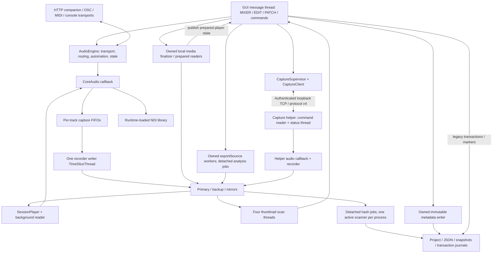

# October 5 software audit: evidence and repair register

The final repaired S6 source passed **519 groups with zero failures in each of
three full suites: optimized Release, ThreadSanitizer, and
AddressSanitizer/UBSan/float-cast-overflow**. No sanitizer reports were emitted.
All three builds, universal GUI/helper architectures, design/invariant gates and
deep/strict signatures pass. The optimized deadline regression now passes with
its unchanged threshold. Final embedded-helper TERM/INT probes also pass within
their no-device, empty-capture scope. The final bounded disk-full repeat passed
five groups. Normal startup smoke is waiting on macOS microphone consent; it
is not a smoke pass. The verified S6 GUI/helper pair is installed on the
development Mac and left closed; physical long-take acceptance remains pending.

The repair moves local STOP media finalization and interactive metadata I/O onto
owned workers, keeps completion truthful, batches preference resets, and repairs
recording/report ownership, persistence, audio-boundary and authenticated-control
defects. Every accepted defect has recorded red evidence and regression coverage.
The ranked register maps defects to tests; the ledger retains earlier failing and
passing snapshots without treating them as the final S6 result.

The operator complaint is slow commands and prolonged STOP finalization. The
October 5 production sample showed post-stop analysis and a functioning UI event
loop; it did not reproduce that earlier freeze during its short observation.
The controlled metadata barrier and subsequent media-finalization barrier did
reproduce message-thread blocking, independently establishing both mechanisms.

## Operator report: repaired source passes controlled verification

Local STOP stops accepting capture samples once, then an owned worker finalizes
media and playback readers while UI messages/navigation continue. The
`finalization pending` status means required work is unfinished. A completed
success means media finalization and required metadata/snapshot writes completed;
it does not mean asynchronous SHA-256 verification has finished. Failures remain
visible with their cause. Remote STOP retains its first-tap confirmation, reports
pending after confirmation, and requires a later retry to acknowledge completion.

The controlled 27-track fixture verifies accepted frames and message processing
through delayed I/O. It does not establish latency for the real interface,
external volume or a multi-hour take. Audio container and session JSON formats
are unchanged. Capture control upgrades to protocol 4, so deploy the GUI and
matching helper together after any take has ended. The orchestrator installed
that verified pair after confirming neither GUI nor helper was running; it
remains closed pending microphone consent and native smoke.

S6 Release and sanitizer validation cover STOP responsiveness, metadata
failure/lifetime handling, finalization telemetry and request framing/deadlines.
This is not a physical-rig latency measurement or a zero-leak certification.
Apple `leaks --atExit` reported the same nonzero framework connection cycles in
the baseline full and repaired Main workloads; details and differing scopes
remain explicit below. Final disk-full verification passed; isolated normal
startup is consent-gated. Installation is verified as recorded below; no native
UI or hardware acceptance is claimed.

## Durable evidence archive

The private archive at
`/Users/jeanpierre/Desktop/zynforge/audit-evidence-20261005` retains 147 text
evidence files plus `manifest.json` with SHA-256 values. It includes final-suite,
build, runtime, leak, TCC and installation records. Temporary paths in the ledger
identify original runs; use the archive for durable copies. A Git patch is to be
added after source integration/commit. The private evidence archive is separate
from the source repository and is not a public artifact.

## Scope and evidence identity

| Item | Evidence |
| --- | --- |
| Source baseline | `f04ee271458f76db5ec8fa27b74fd2a3d4dd39b8`, initially clean |
| Original repository | `/Users/jeanpierre/Desktop/zynforge/ZynforgeRecording` |
| Clean baseline worktree | `/Users/jeanpierre/Desktop/zynforge/ZynforgeRecording-audit-20261005` |
| Test/repair worktree | `/Users/jeanpierre/Desktop/zynforge/ZynforgeRecording-audit-tests-20261005` |
| Target | macOS 12.0+, universal ARM64/x86_64; runtime observation on ARM64 |
| Observed host | macOS 26.6.2 (25G83), eight physical/logical cores, 16 GiB RAM, 16 KiB pages |
| Toolchain | Xcode 27, Apple Clang 21, CMake 4.3.2 |
| Direct dependency | JUCE 8.0.4, immutable commit `51d11a2be6d5c97ccf12b4e5e827006e19f0555a` |
| Installed GUI | Documented `55d62eb` development build; distinct from the audit branch |
| Observation time | Approximately 2026-10-05 00:50–00:53, Asia/Beirut |

All eight requested roles supplied reports before test changes were authorized:
Cartographer, Specification Auditor, Static Analyst, Concurrency and Memory,
Runtime and Hardware-Adjacent, Test Engineer, Security and Supply Chain, and Fix
and Regression planning. Limited concurrency slots required successive roles.
Findings remain candidates until the identified workload provides evidence.

Production recording was initially protected by the user's instruction not to
stop it. The user subsequently confirmed that recording had finished. Audit
agents did not stop the app, change its controls, issue production transport
commands, replace its bundle, or modify recorded media.

## What the application does

ZynForge Recording records console/interface inputs, plays them back through
configured physical outputs for virtual soundcheck, and maintains editable
sessions with clips, takes, automation, cues and mixer state. It supports stereo
tracks, continuation/punch recording, parallel destination copies, offline
exports/bounces and optional console/remote integration. It has mixer/summing
behavior but does not host audio plugins.

The optional `ZynforgeCapture` helper moves capture into a second process. This
protects a take from some GUI failures, not from failure of the computer, storage,
interface, power supply or shared operating system.



### Build, startup and shutdown

`CMakeLists.txt` builds the GUI, embedded fonts and a capture helper. The GUI
depends on the helper, embeds it under `Contents/MacOS/ZynforgeCapture`, then
ad-hoc signs both. Tests are compiled into the GUI and selected by `--run-tests`;
there is no separate CTest executable. CI contains static gates and Debug/Release
builds/tests, but no sanitizer job at baseline.

JUCE is SHA-pinned. Configuration deliberately patches its bundled libFLAC
null-pointer arithmetic guard and fails if the source no longer matches the
expected vulnerable or corrected text. Dependency source must therefore be
copied independently when constructing another worktree build.

GUI startup ignores SIGPIPE, enables optional preference isolation/test mode,
then constructs the main window after a brief splash. It restores session/UI
state, queues recovery/welcome flows, and may reattach to the helper. The
`useCaptureDaemon` setting defaults false. Companion, OSC, MIDI, NDI, mirroring
and upload facilities are optional. Autosave defaults to five minutes.

Quit normally passes through save/capture confirmation. Owned export/bounce
threads are cancelled and joined before engine destruction. Accepted metadata
jobs drain; owned media finalization and reader retirement finish before their
engine/player ownership ends. Hash completion is
detached and can remain pending if the process exits. The helper ignores SIGPIPE;
its first SIGTERM/SIGINT waits for the rolling take to finish, while a second
signal requests finalization. Isolated TERM/INT fixtures exercised this behavior
with no audio callbacks; a loaded capture is still a separate field check.

### Persistence and trust boundaries

Session media lives under `Audio Files/`, with legacy root-level media supported.
Session state spans `.zfproj`, `session_mix.json`, `session_settings.json`, markers,
console state and the capture report. Ordinary backup snapshots contain metadata,
not a historical copy of the audio. Punch replacement and track reorder mean
audio cannot universally be described as immutable.

Individual metadata files use unique temporary siblings followed by replacement.
The complete multi-file save is not one atomic transaction. Reorder journals and
removed-track archives carry different retention obligations from snapshots.

Untrusted inputs include imported audio, session/project JSON, paths and symbolic
links, waveform caches, OSC/HTTP/TCP/MIDI messages and optional native libraries.
Capture transport is loopback TCP. The baseline trusted a version-only handshake;
the repaired protocol authenticates both peers with per-user capability proofs.
Protocol compatibility alone is not peer identity. Companion HTTP/OSC capability
tokens and optional LAN exposure form separate trust boundaries. NDI is loaded
dynamically; optional `lame` and configured upload programs execute outside the
JUCE binary.

## Ranked defects and regression mapping

Source anchors below refer to the baseline; line numbers may shift as tests and
repairs land. All repaired regression paths in this register pass full S6
Release, TSan and ASan/UBSan/float-cast-overflow suites, including R10/R28 timing.
S5 Release failure remains historical evidence below. Row-level S1/S3/S4 labels preserve their earlier green
checkpoints: S1 was the 494-group stage-one full runs, with the then-unrepaired
R01 media-finalization oracle failing. Source/test evidence does not establish
latency or acceptance on the physical production rig.

| ID / priority | Mechanism and affected path | Expected behavior and automated oracle | Status |
| --- | --- | --- | --- |
| R01 / high performance | `MainComponent::stopActiveCapture` calls engine finalization and `saveSessionStateTo` inline; session writes, project read/merge and snapshot copies are on the GUI thread. View changes also call `saveUILayoutToActiveSession`. | Delayed metadata I/O must allow a queued UI sentinel to run while the operation is outstanding; success/failure must wait for mandatory persistence. `MainTransportRegressionTests` gates actual snapshot I/O and posts a UI sentinel through `onSaveSessionState`. | Confirmed metadata/UI red (14 groups/9 failures across UI suite); media red in stage-one concurrency. Both S5 full sanitizer suites pass the repaired metadata/media paths |
| R02 / high integrity | `MultitrackRecorder.cpp:710` invalidates the old hash job before later start validation can fail. | A refused start leaves the previous take's report able to finish. `ConcurrencyAuditTests`: refused-start integrity job. | Confirmed red; repaired assertions pass in S1 |
| R03 / high integrity | Same per-recorder generation cancels session A hashing when session B starts, although the paths differ. | Independent sessions finish their own hashes. `ConcurrencyAuditTests`: another-session hashing. | Confirmed red; repaired assertions pass in S1 |
| R04 / high integrity | Final worker checks generation at `MultitrackRecorder.cpp:2228`, then publishes later; newer STOP can publish between check and rename. | Older completion never replaces newer pending/final metadata. Barrier-controlled `ConcurrencyAuditTests`: old final report. | Confirmed red; repaired assertions pass in S1 |
| R05 / high correctness | Resampled import/export uses JUCE reader-source flow whose decoder read result is discarded; direct export paths also need failure propagation. `AudioImport.cpp:80–104`, `TrackExporter.cpp:203–234,284–319`. | Inject a reader that succeeds once then fails; fail visibly, preserve existing deliverable, remove partial files. `AudioImportTests`, `StereoExportTests`, `FailingAudioReader.h`. | Confirmed import red (6/2) and export red (9/12); repaired assertions pass in S1 |
| R06 / high correctness | Persisted automation curve integer is cast without validation; interpolation can use uninitialized `shaped`. `AudioEngineAutomation.cpp:261,491–514`. | Invalid curve values normalize to defined linear behavior before interpolation. `AutomationTests`: invalid persisted curves. | Confirmed automation red (13 groups/2 failures); repaired assertions pass in S1 |
| R07 / high correctness | Playlist sample coordinates pass through double and lack endpoint/range validation. `AudioEngineClips.cpp:421–425`; downstream endpoint addition in `SessionPlayer.cpp:379`. | Preserve valid integers above 2^53 exactly; reject negative, overflow and out-of-range coordinates while retaining an initialized empty take. `PlaylistBoundaryTests`. | Confirmed numeric red (9 groups/19 failures), plus UBSan boundary evidence; repaired assertions pass in S1 |
| R08 / high persistence/security | Snapshot root/candidate symlinks can redirect snapshot writes or retention outside the session. `SessionBackup.h:22–28,51–67`. | Refuse linked roots; exclude linked candidates; retain external sentinels. `SessionBackupTests`. | Confirmed snapshot red (7 groups/25 failures across suite); repaired assertions pass in S1 |
| R09 / high endpoint trust | `CaptureLink.cpp:150–175` supersedes the existing controller before handshake; `:206–228` verifies only protocol version. | A connection without authentication cannot evict the controller; a matching-version fake service is not trusted. `ConcurrencyAuditTests`: connection eviction and fake daemon. Authenticated fixture adaptation will be needed when identity is added. | Confirmed eviction/fake-peer red; protocol-4 repaired assertions pass in S1 |
| R10 / high responsiveness | Capture request waits for blocking send before its reply timeout starts. `CaptureLink.cpp:73–83,341–366`. | A non-reading disposable peer cannot exceed the command deadline. Test uses a 512 KiB frame, small socket buffers and bounded peer-close watchdog. `ConcurrencyAuditTests`. | Confirmed deadline red (100 ms request took 1153 ms); S1/S5 sanitizer assertions passed while S5 Release remained red. Phase trace measures native send blocking 712.261 ms on a blocking descriptor; explicit O_NONBLOCK repair passes all three full S6 suites |
| R11 / high concurrency | Lazy companion `unique_ptr` assignment on UI thread races callback read. `AudioEngine.cpp:320,328,3329`. | First companion start during synthetic callback pumping is TSan-clean. `ConcurrencyAuditTests`. | Confirmed TSan race; S1 workload emits no report |
| R12 / high concurrency | Companion producer overwrites plain float ring slots while lagged consumer reads them; write-index publication does not reserve old slots. `CompanionServer.cpp:532–533,886–895`. | Small-ring wrap under a real stream worker is TSan-clean. `ConcurrencyAuditTests`. | Confirmed TSan race; S1 workload emits no report |
| R13 / medium concurrency | `captureStatus` reads vector size before acquiring the structural lock. `AudioEngine.cpp:857,874`; `MultitrackRecorder.h:148`. | Status polling concurrent with permitted resizing is TSan-clean. `ConcurrencyAuditTests`. | Confirmed TSan race; S1 workload emits no report |
| R14 / medium security | Companion UUIDs and OSC Random tokens lack an explicit OS-entropy capability contract; pinned JUCE UUID uses its PRNG. | Consume 32 OS-random bytes; entropy failure must leave no listener/fallback token. `AuditSecurityTests`. | Confirmed security red (5 groups/15 failures across suite); repaired assertions pass in S1 |
| R15 / medium security | OSC diagnostic logging includes the final authentication argument before checking it. `OscRemote.cpp:38–48`. | Authenticated command still works and address remains useful in diagnostics, but token canary never appears. `AuditSecurityTests`. | Confirmed token-canary red; repaired assertions pass in S1 |
| R16 / medium persistence | Same-second snapshot suffixes sort lexically, potentially retaining old contents or pruning the returned snapshot; invalid retention can remove recovery state. | Fourteen saves at fixed time retain newest ten; zero/negative retention refuses without mutation. `SessionBackupTests`. | Confirmed chronology/invalid-retention red; repaired assertions pass in S1 |
| R17 / medium export | Legacy stereo export uses the left source sample rate for both sides. `TrackExporter.cpp:259–262,288–289`. | Mismatched source rates refuse before replacing an existing destination. `StereoExportTests`. | Confirmed mismatched-rate export red; repaired assertions pass in S1 |
| R18 / medium operator correctness | Remote STOP infers success from recording becoming false despite failed mandatory metadata finalization. `MainComponent.cpp:617–634`. | Second STOP reports failure with explanation while captured media survives. `MainTransportRegressionTests`. | Confirmed UI red; pending/retry and failure-latch repaired assertions pass in S1 |
| R19 / medium persistence | Cue-update paths can ignore persistence return values and show ordinary success. `MainComponentCues.cpp` cue mutation paths. | Visible failure, retained in-memory edit and preserved existing disk sentinel. `MainTransportRegressionTests`. | Confirmed cue failure red; repaired assertions pass in S1 |
| R20 / medium timekeeping | Daemon freshness/backoff uses wall time; backward clock movement can prolong apparent freshness/retry delay. `CaptureSupervisor.cpp:42,190–197`; `AudioEngine.cpp:808–812`. | Future receipt timestamps are not considered indefinitely fresh; eventual fix should use monotonic elapsed time. `ConcurrencyAuditTests` injects timestamps without changing host clock. | Confirmed future-timestamp red; repaired assertions pass in S1 |
| R21 / medium integrity | `deleteCaptureSession` recursively deletes without cancelling or excluding report publication; a paused worker can later fail its write and raise an unrelated integrity error. Atomic staging creation may also race recursive deletion, but the baseline failure's exact errno is not captured. | Gate final publication, delete through the real UI helper, release worker: directory stays absent, current session stays unchanged, no false async integrity failure. `ConcurrencyAuditTests`: deleting capture. | Baseline deletion failed; deterministic false-integrity-error red reproduced; repaired assertions pass in S1 |

Review findings discovered while exercising the repair are tracked separately:

| ID | Mechanism and oracle | State |
| --- | --- | --- |
| R22 / high outcome correctness | The old local STOP predicate includes report/punch/stereo failures; daemon STOP also rejects primary/device/backup/mirror/skipped/recovery failures. Inject each existing latch after writing a valid disposable block; async STOP must retain the cause, return false for a failed take and still persist metadata. Missed-sample policy is unchanged. | Confirmed red: six omitted causes each falsely acknowledged success; shared cause reporting and engine predicate repaired; S3 full TSan and ASan/UBSan assertions pass |
| R23 / medium UI correctness | New File Save enablement depends on metadata ownership and capture finalization, but its native-menu refresh signature lacks those conditions. A real `MenuBarModel::Listener` must receive invalidations as ownership changes with `sessionIoBusy` held true. | Confirmed red: native-menu invalidations missing at tests 3/5/7; minimal signature repaired; S3 full TSan and ASan/UBSan assertions pass |
| R24 / high playback correctness | Retaining extra readers across a punch leaves cached cross-track media bound to prior contents after replacement. Existing comp edits must survive while media readers refresh by source identity. | Confirmed reviewer red: copied clip expected 0.75, read stale 0.25; reader refresh repaired; S3 full TSan and ASan/UBSan assertions pass |
| R25 / high concurrency | Worker finalization may retire telemetry vectors while UI/status readers inspect them. A controlled async STOP/status-poll workload must be TSan-clean through retirement. | Confirmed TSan retirement race and SEGV; stable lifetime/atomic telemetry repaired; S3 full TSan and ASan/UBSan assertions pass |
| R26 / high performance | Per-field strip reset repeatedly reloads the whole shared preferences file. Measured red: full reset 1,537 reloads; ten-slot range reset 61. Batch names, colours, gain/pan and routing separately, each replacing its cache once before mutation/save; reload appProps once. Oracle: at most five reloads for reset/private range, with sibling edits/deletions and untouched slots preserved. Public growth 2→6 measured 30 reloads with semantics passing; UUID work is counted separately. | Confirmed Release red in `Settings batch reset audit`; S4 targeted Release green: reset/range reloads 5/5 and growth 10, all semantic assertions pass |
| R27 / medium persistence correctness | `clearAllStripOverrides` removes a legacy send-key pattern but leaves `strip_send_<index>_<slot>_{bus,dB,post}` fields. Seed both formats, reset and independently reload persisted preferences; all covered send fields must disappear while unrelated preferences survive. | Confirmed red: 36 current-format send fields survived; S4 targeted Release green: current/legacy cleanup and unrelated-preference assertions pass |
| R28 / high responsiveness/correctness | Extension of R10's end-to-end request deadline: unbounded JSON serialization can consume the budget before socket writes, and a timeout before any byte is written closes an untouched healthy connection. Outbound oversized frames also reach the handler. Bound formatting by deadline and wire size before taking the socket lock; a refused pre-send request must preserve connection/Ping reuse. | Confirmed authoritative frame-boundary red: 731 ms request, healthy connection closed/Ping failed, oversized outbound handler count 1. Bounded formatter and healthy-reuse regressions pass both S5 full sanitizer suites; S5 Release timing was red (732 ms > 700 ms), trace isolated delay to kernel send on a blocking descriptor; S6 O_NONBLOCK passes all three full suites |
| R29 / high input-boundary correctness | Incoming framing checks buffered size but misses an oversized completed line. A raw JSON line of 1 MiB + 1 must be rejected before decoding or handler dispatch and the offending connection closed. | Confirmed authoritative frame-boundary red: oversized completed line dispatched once and connection stayed open. Pre-dispatch completed-line rejection regressions pass both S5 full sanitizer suites |

Additional unresolved workload targets:

- Detached post-stop jobs are not durable scheduled work. A process exit can
  leave `sha256Pending` indefinitely; do not treat absence of `sha256Failed` as
  completion. Resume/requeue semantics require an explicit acceptance decision.
- Each STOP launches a thread before acquiring the global scan mutex; repeated
  STOPs can accumulate blocked workers/snapshots. The repair now prunes expired
  weak registry entries on lookup; a repeated-session growth benchmark has not
  yet established total pending-worker or allocator behavior.
- NDI sends on the callback and shutdown spins until in-flight calls return.
  No runtime latency guarantee or injected blocking-send workload has been tested.
- Four background-priority thumbnail threads still issue simultaneous reads.
  Lower scheduling priority does not bound disk-I/O latency.
- The disabled multiwriter selector is intentional dormant functionality:
  `chooseShardCount()` returns one. Do not re-enable it from the outdated pool
  sizing comment; earlier source notes describe corruption with parallel writers.

## Runtime evidence

### Historical pre-repair production observation

At this earlier observation, the installed `55d62eb` GUI SHA-256 was
`0a08743f6448d46068f087465721f55df5e6316b80517d6290cf6af649df9475` and helper SHA-256
was `405d815d1005e224dc6294fdf2c5fa7e109de81c10620ed0c17feaf82e3b8384`, both matching
the then-current installation record. This is historical pre-S6 evidence;
[INSTALL.md](../INSTALL.md) owns current installed identities. Strict deep bundle verification passed. The app was
running native ARM64 despite both executables containing universal slices.

The sampled PID 32335 used approximately 81–82% CPU and 227 MiB RSS. `sample`
reported a 693.6 MiB physical footprint, peak 699.0 MiB, and 26 threads. There were
66 numbered file descriptors, including 55 session-media descriptors and two
loopback IPv4 sockets (listener port 9000).

The three-second stack sample is retained at
`/private/tmp/zynforge-audit-20261005-live-sample.txt`. All four thumbnail threads
were in `readMaxLevels -> WavAudioFormatReader -> FileInputStream -> read` for
240–244 of 246 samples each. The single hash worker spent 218 samples sleeping at
its intentional throttle, 19 reading and nine hashing. Recorder/player writer
threads waited. The main thread processed events and painted; no synchronous
metadata-save blockage was captured in this window.

The external volume `PJ ` is ExFAT on an external PCI-Express SSD, `disk4s2` on
`disk4`, approximately 2 TB total with 1.406 TB free. Bounded `iostat` intervals
showed roughly 2.4–2.6 GB/s device-wide activity; this is not a process-attributed
throughput measurement. Host memory was compressed, with approximately 3.1 GiB
occupied by compressor and no reported swapins/swapouts; this snapshot does not
establish a memory-pressure failure. Launchd's default descriptor limit is not the
app's proven limit: JUCE attempts to raise it at static initialization.

### Recorded take

Session `/Volumes/PJ /testtttttt/testttt au plugins` reported STOP at
`2026-10-05T00:42:23.292+03:00`, 27 tracks, 48 kHz and 816,743,936 samples
(approximately 4 h 43 m 35.5 s). Its report contained zero missed samples and no
primary, device, mirror or punch error. Backup was inactive; mirrors skipped was
zero. Hashes remained pending, and the recording marker was absent.

File metadata showed 27 WAVs of equal size, 2,450,232,592 bytes each, totaling
66,156,279,984 bytes. Audit agents did not independently hash/decode this take.
Equal sizes and self-reported capture counters are not full content verification.

At a later root-agent process check, PID 32335 and other Zynforge GUI/helper
processes were absent. No audit agent closed them. No matching `Zynforge*.ips`
file was found by the bounded diagnostic-report glob. The report was still
`sha256Pending=true`, `sha256Failed=false`, with its original STOP-time mtime.
The evidence does not establish why the process exited and does not justify
calling the hashes complete or diagnosing a crash.

## Supply-chain coverage

Local JUCE HEAD and the documented FLAC guard were inspected; CMake and CI action
references are immutable SHAs. Bundled headers identify FLAC 1.4.3, Vorbis 1.3.7,
libpng 1.6.37, zlib 1.2.3 and JPEG 6b. Header versions alone do not establish actual
vulnerability reachability or patched-source equivalence.

The Security specialist reviewed current primary references:
[JUCE security](https://juce.com/security/),
[JUCE advisories](https://forum.juce.com/c/security-advisories/36),
[libpng GHSA-qvg3-h654-xq3j](https://github.com/pnggroup/libpng/security/advisories/GHSA-qvg3-h654-xq3j),
[libpng project advisories](https://www.libpng.org/pub/png/libpng.html), and
[FLAC change history](https://xiph.org/flac/changelog.html).
The libpng advisory requires specific sequential-read API ordering. The pinned
JUCE PNG wrapper calls `png_read_image` before `png_read_end` (`PNGLoader.cpp:419–420`),
an explicitly unaffected sequence for this advisory. This reviewed path does not
prove every possible libpng use safe. No reachable dependency CVE was confirmed.
This is not a clean bill of health: complete SBOM, patch-level/reachability
analysis, full secret-history scan and comprehensive CVE scanning remain open.

## Verification ledger

The initial concurrency red run is recorded in
`/private/tmp/zynforge-audit-20261005-tsan-red-tests.log`; sanitizer stacks are in
`/private/tmp/zynforge-audit-20261005-tsan-red.78913`. The corrected run is
`/private/tmp/zynforge-audit-20261005-concurrency-red2-tests.log` (11 groups,
9 assertion failures), including intentional deletion and the raw fake daemon. Refused-start cancellation,
cross-session cancellation, stale report publication, blocking request deadline,
unauthenticated client eviction and future-timestamp acceptance failed their
oracles. The first fake-daemon fixture incorrectly reused a real server and was
replaced with a raw version-only socket peer; that corrected oracle also failed.
The deterministic delete/publication fixture reproduced a false integrity error
after deliberate deletion. Remaining review oracles are explicitly marked pending in the defect table.

TSan confirmed lazy companion-owner publication, track-vector and shard lifetime
reads outside the status lock, stream-ring float read/write overlap, and
`CaptureServer::stop` reading `clientThread.get_id()` while `acceptLoop` assigned
that `std::thread`. Assertion-only success for a TSan workload is not a pass when
its sanitizer emits a race.

Concurrency changes exercised by the stage-one repaired workloads: per-session report publication
ownership and cancellation on intentional deletion; weak registry entries that
expire after jobs/tokens finish; companion allocation before audio callbacks;
whole-status structural locking; future-clock rejection; lock-free atomic stereo
ring cells with sequence validation and stale-chunk dropping. Root implemented the
transport authentication/deadline/lifecycle repair. Recorded workload results,
not source inspection, establish the interim passes below.

The other isolated red reports (under `/private/tmp/`) are:

| Report suffix after `zynforge-audit-20261005-` | Completed groups / failures |
| --- | --- |
| `backup-red-tests.log` | 7 / 25 |
| `ui-red2-tests.log` | 14 / 9 |
| `import-red-tests.log` | 6 / 2 |
| `export-red-tests.log` | 9 / 12 |
| `automation-red-tests.log` | 13 / 2 |
| `numeric-red-tests.log` | 9 / 19 |
| `security-red-tests.log` | 5 / 15 |

The first UI-only attempt failed in the test harness before its first group:
fixture setup called `expect` before `beginTest`. The corrected fixture begins its
own setup group; `ui-red2-tests.log` is the valid UI red evidence. The instrumented
numeric run additionally stopped on its undefined numeric boundary; the completed
non-aborting numeric red is the 9/19 report above.

| Check | State at this checkpoint | Evidence/limit |
| --- | --- | --- |
| Clean universal Release configure/build | PASS (baseline) | `/private/tmp/zynforge-audit-20261005-configure.log`; `-baseline-build.log` |
| Existing clean-baseline suite | 440 groups / 1 failure | `/private/tmp/zynforge-audit-20261005-baseline-tests.log`; capture deletion after stop/switch |
| S3 design/invariant gates | Repair-3 source CLEAN; retained checkpoint | `/private/tmp/zynforge-audit-20261005-repair3-design.log`; `-repair3-invariants.log` |
| Pre-repair installed identity/signatures and read-only production sample | DONE, historical | Applies to then-installed `55d62eb`, not S6 |
| Corrected concurrency red | 11 groups / 9 failures, with source races | `/private/tmp/zynforge-audit-20261005-concurrency-red2-tests.log`; sanitizer red stacks above |
| Stage-one targeted concurrency under TSan | 12 groups / 1 expected new media-blocking failure | `/private/tmp/zynforge-audit-20261005-concurrency-repair1-tests.log`; no emitted TSan report in orchestrator check |
| Stage-one full ASan/UBSan | 494 groups / 1 expected media-blocking failure | `/private/tmp/zynforge-audit-20261005-full-repair1-tests.log`; no emitted sanitizer report |
| Stage-one full TSan | 494 groups / 1 expected media-blocking failure | `/private/tmp/zynforge-audit-20261005-full-repair1-tsan-tests.log`; no emitted sanitizer report |
| Stage-two targeted concurrency under TSan | 13 groups / 0 assertion failures | `/private/tmp/zynforge-audit-20261005-concurrency-repair2-tests.log`; final-source full rerun still required |
| Stage-two main transport under ASan/UBSan | 18 groups / 0 failures | `/private/tmp/zynforge-audit-20261005-main-repair2-tests.log`; no emitted sanitizer report |
| Isolated TERM and INT probes | PASS within stated fixture | No audio callbacks; verifies two-step rolling signal semantics and empty-file finalization only |
| Bounded disk-full probe | PASS within stated fixture | Real ENOSPC on disposable 32 MiB image; synthetic export only |
| S3 universal Release build and bundle signatures | PASS reported by orchestrator | Both arm64 and x86_64; retained checkpoint; final target now S5 |
| S3 full TSan | 512 groups / 0 assertion failures; no emitted sanitizer report files | `/private/tmp/zynforge-audit-20261005-full-repair3-tsan-tests.log` |
| S3 full ASan/UBSan | 512 groups / 0 failures; no emitted ASan/UBSan report files | `/private/tmp/zynforge-audit-20261005-full-repair3-asan-tests.log` |
| R26/R27 Release red | 4 groups / 38 failures | `/private/tmp/zynforge-audit-20261005-settings-red-tests.log`; reset 1,537 reloads, range 61, 36 surviving send fields |
| S4 targeted preference Release suite | 4 groups / 0 failures | `/private/tmp/zynforge-audit-20261005-settings-repair4-tests.log`; reset 5 reloads, range 5, public growth 10 |
| S4 Release, TSan and ASan/UBSan builds | PASS reported by orchestrator | Universal Release GUI/helper both arm64 and x86_64; strict signatures pass |
| S4 design/invariant gates | CLEAN reported by orchestrator | Retained checkpoint; later R28/R29 fixes require S5 gates |
| S4 full TSan | 516 groups / 1 assertion failure; no emitted sanitizer reports | Historical deadline miss: 759 ms against 700 ms; not accepted at S4, resolved by later S6 verification |
| S4 full ASan/UBSan | 516 groups / 0 failures; no emitted ASan/UBSan reports | Confirmed by orchestrator; does not clear the separate deadline red |
| Apple leaks, repaired Main workload | 28 groups / 0 assertions; 288 allocations / 18,816 bytes reported | Three Apple AppIntents/LinkServices NSXPCConnection cycles, no project allocation root identified; baseline full workload reports identical allocation total/roots, no leak-free claim |
| Apple leaks, baseline full workload | 440 groups / 0 assertions; same 288 allocations / 18,816 bytes and three framework cycles | `leaks-baseline-full.log` and `leaks-baseline-full-tests.log`; prior baseline deletion red retained |
| Initial deadline Release red | 16 groups / 3 failures | 728 ms request plus two connection-health/reuse failures; outbound oversize oracle incomplete, superseded for boundary evidence below |
| Authoritative frame-boundary Release red | 17 groups / 6 failures | `/private/tmp/zynforge-audit-20261005-frame-boundary-red-tests.log`; 731 ms request, healthy reuse failures, oversized outbound/inbound dispatch, incoming connection left open |
| S5 Release, TSan and ASan/UBSan builds | PASS reported by orchestrator | Separate Xcode build directories; universal Release GUI/helper and deep/strict signatures pass |
| S5 design/invariant gates | CLEAN reported by orchestrator | Frozen source manifest identity below |
| S5 full TSan | 519 groups / 0 failures; no emitted sanitizer reports | `/private/tmp/zynforge-audit-20261005-full-repair5-tsan-tests.log` |
| S5 full ASan/UBSan/float-cast-overflow | 519 groups / 0 failures; no emitted sanitizer reports | `/private/tmp/zynforge-audit-20261005-full-repair5-asan-tests.log` |
| S5 full Release tests | 519 groups / 1 failure | Historical original-deadline miss: 732 ms > 700 ms; rejected at S5, resolved by S6 below |
| Deadline phase diagnostic | 17 groups / 1 failure; request 731 ms | `/private/tmp/zynforge-audit-20261005-deadline-phase-trace.log`; native send 712.261 ms, detailed breakdown below |
| S6 Release, TSan and ASan/UBSan builds | PASS reported by orchestrator | Universal GUI/helper, deep/strict signatures and design/invariant gates pass; independent static review found no blocker |
| S6 full optimized Release | 519 groups / 0 failures | `/private/tmp/zynforge-audit-20261005-full-repair6-release-tests.log` |
| S6 full TSan | 519 groups / 0 failures; no emitted sanitizer reports | `/private/tmp/zynforge-audit-20261005-full-repair6-tsan-tests.log` |
| S6 full ASan/UBSan/float-cast-overflow | 519 groups / 0 failures; no emitted sanitizer reports | `/private/tmp/zynforge-audit-20261005-full-repair6-asan-tests.log` |
| S6 embedded-helper TERM/INT repeats | PASS within no-device fixture | `zynforge-audit-runtime-pgqli51c/result.json` and `zynforge-audit-runtime-anvl8rdi/result.json`; zero captured samples |
| S6 final bounded disk-full repeat | 5 groups / 0 failures; real ENOSPC | `zynforge-audit-runtime-_9o77bjh/result.json`; 32,702,464 filler bytes, disposable image detached; synthetic PCM export only |
| S6 final Main Apple leaks | 28 groups / 0 assertions; same 288 allocations / 18,816 bytes / three Apple cycles | Matches baseline framework residual; no project allocation root or zero-leak claim |
| Isolated normal UI smoke | CONSENT-GATED, not passed | New code identity prompted for microphone access; scoped AX/sample/TCC evidence below |
| Physical-rig acceptance | PENDING | No real capture/interface or external-session mutation in these fixtures |

The S4 Release executable identities verified by the orchestrator are:

| Executable | SHA-256 |
| --- | --- |
| GUI | `0bd1cec20d4e27e1c2855ea435e22b46691ee203bafcf99eec781a945a3f70ab` |
| Embedded capture helper | `78698d4f11445ebd6832ce95ccf88d4fb7bd8b0f77c28447f8ca4ceadb396028` |

These identify the isolated S4 build, not an installed or deployed application.
S5 serializer/frame executable identities are recorded separately below.

S5 freezes 253 source paths under manifest SHA-256
`f29616895b915214c900ea09d250d5730e5013a56133a23a4bf435df2ce14a18`.
All three builds and the design/invariant gates passed; the universal Release
GUI/helper passed deep/strict signature checks. Its executable identities are:

| S5 executable | SHA-256 |
| --- | --- |
| GUI | `a0bde04e7a6240fa1d4cff3155c52bbdfc995ac46cdd9485529d91180ac6384c` |
| Embedded capture helper | `1b18de6bf96ccd4680c3f136b072168ff573daae60e393c8ef33b4ab395ed934` |

Both full S5 sanitizer suites completed 519 groups with zero failures and no
emitted reports. These identities do not imply deployment or physical-rig
acceptance. The separate S5 Release suite completed 519 groups with one
request-deadline failure (732 ms > 700 ms), requiring the subsequent S6 repair
and passing verification recorded below.

S6 freezes 253 source paths under manifest SHA-256
`1d916b93ee5f3b2dc35f61f497615ee828fabce2d8b11d63cda9621efab98fdd`.
All three builds, design/invariant gates and universal GUI/helper deep/strict
signatures pass. Independent static review found no blocker. Its executable
identities are:

| S6 executable | SHA-256 |
| --- | --- |
| GUI | `cf84bfe554d7916e60251d86e9f82d54b451d3a903da2c85d2b57b632e8faa98` |
| Embedded capture helper | `015a3706a066238b57092fc683299657fe49b0e06c694ac83b943100739c5787` |

All three full S6 suites completed 519 groups with zero failures; no sanitizer
reports were emitted. The earlier request-deadline, healthy-reuse and frame-size
checks pass. This establishes controlled source acceptance; installation is
recorded separately below and does not establish physical-rig performance. S5 identities and results remain historical evidence.

### Verified development-Mac installation

The orchestrator atomically installed the tested S6 GUI and embedded helper at
`/Applications/Zynforge Recording.app` after verifying neither process was
running. Installed executable SHA-256 values match the S6 values above, and
deep/strict bundle verification passed. The app was left closed. The prior
bundle is preserved at
`/Applications/Zynforge Recording.app.backup-20261005-031802-before-audit`.

The development Mac now has protocol 4; the Mac mini and existing distribution
image are not upgraded by this installation. The earlier `55d62eb`/protocol-3
records below are historical. Microphone consent and normal UI smoke remain
pending; installation/hash verification is not native startup or physical-rig
acceptance. [INSTALL.md](../INSTALL.md) is the current deployment authority.

The local outcome reviewer red is
`/private/tmp/zynforge-audit-20261005-review-outcome-red-tests.log`: 28 groups,
27 failures. Three are the already-recorded menu invalidations; the other 24 are
four assertions for each of six omitted local failure causes (primary, device,
backup, mirror, skipped mirror and recovery marker). Existing punch/stereo/report
failure assertions passed. No TSan report was emitted for that outcome workload.
The repair applies the daemon's existing required-copy/device failure policy to
local async completion and reports each cause, retaining local punch/stereo and
prepared-reader checks. It does not add missed samples to either success policy.
The separate telemetry workload produced an actual Mirror-vector retirement race
and a SEGV during a disk-metric atomic load in its first group. The stack artifact
is `/private/tmp/zynforge-audit-20261005-review-telemetry-red2-tsan.94711`.
Its stable-lifetime/atomic-telemetry repair passed both S3 full sanitizer
suites; the later S4 TSan run emitted no reports and failed only the separate
request-deadline assertion.

The menu reviewer red is
`/private/tmp/zynforge-audit-20261005-review-menu-red-tests.log`: tests 3, 5 and 7
missed native menu invalidations while the underlying Save eligibility changed
(19 groups / 3 failures). The authorized repair adds metadata-ownership and capture-finalization booleans
to the existing refresh signature; it passed both S3 full sanitizer suites.

The reader-cache reviewer red is
`/private/tmp/zynforge-audit-20261005-review-crossreader-red-tests.log`: the copied
clip returned stale sample 0.25 instead of replacement sample 0.75. That 14-group
run had two failures; the other was a request-deadline fixture taking 757 ms
against its 700 ms bound during simultaneous rebuilds. The unchanged oracle
passed when rerun without competing builds. The isolated reader rerun,
`/private/tmp/zynforge-audit-20261005-review-crossreader-red2-tests.log`, completed
14 groups with only the stale-reader failure; no additional deadline repair or
test-threshold relaxation was made at that checkpoint. The later S4 full TSan
run reproduced a 759 ms deadline miss; a subsequent Release red had 16 groups
and three failures (728 ms plus two health/reuse assertions). Its outbound-size
oracle was incomplete. The corrected authoritative boundary red,
`/private/tmp/zynforge-audit-20261005-frame-boundary-red-tests.log`, completed
17 groups with six failures: 731 ms request duration, healthy connection closure
and failed Ping after a pre-send timeout, oversized outbound handler dispatch,
and dispatch plus retained connection for a completed incoming 1 MiB + 1 line.
The private bounded output stream now limits JSON formatting by deadline/size
before taking the socket lock, and completed inbound lines are checked before
decoding/dispatch. The candidate retains the wire format and existing test
thresholds; both full S5 sanitizer suites pass these regressions, but the
separate Release suite still misses the original deadline (732 ms > 700 ms).
The phase diagnostic below identified the remaining blocking send; its S6
repair subsequently passed all three full suites. The earlier isolated pass does not
dismiss this recurrence. The first
telemetry launch selected no suite because Xcode had not yet regenerated the
source registry; that launch provides no telemetry coverage.

### Measured Release socket-send delay

The temporary phase diagnostic reproduced the Release failure in 17 groups with
one failure (100 ms request completed in 731 ms). Its trace is
`/private/tmp/zynforge-audit-20261005-deadline-phase-trace.log`:

| Phase | Measured milliseconds | Result |
| --- | ---: | --- |
| JSON framing | 17.148 | 524,412-byte frame prepared |
| Socket lock | 0.447 | Lock acquired |
| Writable poll | 0.003 | Reported ready |
| Native send | 712.261 | Returned all 524,412 bytes |
| Complete writeAll | 713.551 | Returned success after request budget |

The connected descriptor remained in blocking mode because JUCE's connect path
restores that mode. On this observed macOS workload, `MSG_DONTWAIT` alone did not
keep the native send within the deadline. Poll readiness did not establish that
the complete frame could be accepted without waiting. Apple's [send(2) manual](https://developer.apple.com/library/archive/documentation/System/Conceptual/ManPages_iPhoneOS/man2/sendto.2.html)
explains that send normally waits when buffer space is unavailable unless the
socket is in nonblocking I/O mode; nonblocking operations report `EAGAIN` when
they would otherwise wait.

S6 explicitly sets `O_NONBLOCK` before sending; no close/lifecycle changes are
part of this repair. The temporary phase traces are removed from the final
candidate. All three full S6 suites now pass 519 groups, including the deadline,
healthy-reuse and frame-size checks. S5 sanitizer runs often exhaust their
budget during slower instrumented formatting, so their passing deadline oracle
does not establish coverage of the same kernel-send path exercised by Release.
Both optimized and instrumented verification remain required.

### Observed instrumented test slowdown

During the S3 full TSan suite, the local primary-failure fixture remained in setup
for more than a minute. The captured stack,
`/private/tmp/zynforge-audit-20261005-full-repair3-primary-sample.txt`, places the
message thread in `AudioEngine::clearAllStripOverrides` →
`StripRouting::clearOutput` → `reloadReplace` → `PropertiesFile::loadAsXml` →
`StringPairArray::set`, with sanitizer instrumentation in the string work. This
sample shows instrumented bulk preference reset work, not a STOP-finalization
lock wait. No assertion or race had been reported at that checkpoint; the suite
was still running at the time of the sample. It later completed all 512 groups
with zero assertion failures and no emitted sanitizer report files.

Source review traced the amplification to six per-strip operations across 256
slots, plus the appProps reload. The deterministic Release red then measured
1,537 reloads for full reset and 61 for a ten-slot range. Its four groups had
38 failures: two operation-count failures and 36 surviving current-format send
fields (R26/R27). Public growth from two to six strips performed 30 reloads with
its semantic checks passing. Evidence:
`/private/tmp/zynforge-audit-20261005-settings-red-tests.log`.

The repair batches each of the four strip modules into one replace-cache,
mutate and save operation, then updates appProps; it also removes both current
and legacy send keys. The S4 targeted Release run measured five reloads for full reset/private range
and ten for public growth including UUID work: four groups, zero failures in
`/private/tmp/zynforge-audit-20261005-settings-repair4-tests.log`. The tests preserve sibling writes/deletions,
unknown keys, untouched slots and in-memory reset behavior. Shared-cache
semantics received independent review. S3 was left unchanged during verification;
Both full S5 sanitizer suites included the serializer/frame repairs; S5 Release
still failed the request deadline. The S6 nonblocking-descriptor repair passes
all three full suites. Optimized Release latency measurements
remain necessary to quantify operator impact.
The repair does not claim that every UI filesystem operation has been removed:
legacy transactional saves, preference operations and volume observations still
have their existing synchronous paths.

Final S6 embedded-helper signal repeats are under the same runtime temporary
root: `zynforge-audit-runtime-pgqli51c/result.json` (TERM) and
`zynforge-audit-runtime-anvl8rdi/result.json` (INT). Both idle and rolling cases
exited zero; first signal preserved the rolling take, final WAV existed and
`sha256Pending` was false. Both reported zero samples because no callbacks were
fed. These certify signal/empty-file semantics only. The final S6 disk-full
repeat passed five groups with zero failures:
`zynforge-audit-runtime-_9o77bjh/result.json` reports real ENOSPC after 32,702,464 filler bytes, and its disposable
image was detached. The fixture uses synthetic PCM export, not production media
or hardware recording.

Runtime probe reports are under
`/private/var/folders/ql/86ds225n16v8p19bj1kmwv040000gp/T/`:
`zynforge-audit-runtime-dm591fhf/result.json` (TERM),
`zynforge-audit-runtime-j003e7lo/result.json` (INT), and
`zynforge-audit-runtime-ix_c2y2v/result.json` (disk-full, with
`disk-full-tests.log` alongside). Signal cases report zero captured samples and
`sha256Pending=false`; they are not loaded audio-stream tests. The disk probe
filled 32,702,464 bytes before headroom adjustment, observed kernel ENOSPC and
detached its disposable image. An initial probe guard rejected a `/var` versus
`/private/var` alias; fixing fixture path canonicalization was not a product fix.

### Commands executed for observation

```bash
sample 32335 3 10 -file /private/tmp/zynforge-audit-20261005-live-sample.txt
ps -p 32335 -o pid,ppid,etime,%cpu,rss,state,command
lsof -p 32335 -n -P -F pftn
iostat -d -w 1 -c 3
vm_stat
sysctl hw.pagesize hw.logicalcpu hw.physicalcpu hw.memsize
diskutil info -plist '/Volumes/PJ '
codesign --verify --deep --strict '/Applications/Zynforge Recording.app'
```

Sampling/process counters initially required read-only sandbox escalation, which
succeeded. No automatic-review rejection remains. Do not repeat PID commands
without re-identifying the process; it has since exited.

### Reproduction commands and final verification still required

The executed builds use the isolated build checkout
`/Users/jeanpierre/Desktop/zynforge/ZynforgeRecording-audit-20261005`, not the
original recording repository. The commands below match its three Xcode
`CMakeCache.txt` configurations. Release is universal; separate Debug sanitizer
builds target arm64. ASan/UBSan includes `float-cast-overflow` explicitly.

All three caches set `FETCHCONTENT_SOURCE_DIR_JUCE` to
`/private/tmp/zynforge-audit-20261005-juce`, whose checked HEAD is the immutable
JUCE 8.0.4 commit `51d11a2be6d5c97ccf12b4e5e827006e19f0555a`. Its sole local
source change is the guarded libFLAC null-pointer fix applied by this project's
CMake configuration. On another host, use an isolated JUCE checkout at that
commit and substitute its absolute path; alternatively omit the override so
FetchContent resolves the same immutable `GIT_TAG` in `CMakeLists.txt`. Do not
reuse a production build's writable dependency tree.

The harness uses the distinct `Zynforge Recording Tests` application identity,
keeps one test process at a time, and isolates settings. Run test launches
sequentially; LaunchServices' exit status alone is not the test outcome. Inspect
the absolute report and sanitizer logs. `--test-filter` matches a registered
suite name case-insensitively and exits nonzero on zero matches; omit it for all
suites. Use fresh report/log names on each run to avoid mixing evidence.

```bash
cd /Users/jeanpierre/Desktop/zynforge/ZynforgeRecording-audit-20261005
cmake -S . -B build -G Xcode \
  '-DCMAKE_OSX_ARCHITECTURES=arm64;x86_64' \
  -DCMAKE_OSX_DEPLOYMENT_TARGET=12.0 \
  -DFETCHCONTENT_SOURCE_DIR_JUCE=/private/tmp/zynforge-audit-20261005-juce
cmake --build build --config Release --parallel 2
open -n -W 'build/ZynforgeRecording_artefacts/Release/Zynforge Recording.app' \
  --args --run-tests --test-report=/private/tmp/zynforge-full-tests.log
tools/design_audit.sh
tools/invariants_audit.sh
```

Do not combine TSan with ASan. These are the actual separate Xcode build
directories and cache flags; `--config Debug` is required for their runs:

```bash
cmake -S . -B build-audit-asan -G Xcode \
  -DCMAKE_OSX_ARCHITECTURES=arm64 -DCMAKE_OSX_DEPLOYMENT_TARGET=12.0 \
  -DFETCHCONTENT_SOURCE_DIR_JUCE=/private/tmp/zynforge-audit-20261005-juce \
  -DCMAKE_C_FLAGS='-fsanitize=address,undefined,float-cast-overflow -fno-omit-frame-pointer' \
  -DCMAKE_CXX_FLAGS='-fsanitize=address,undefined,float-cast-overflow -fno-omit-frame-pointer' \
  -DCMAKE_EXE_LINKER_FLAGS='-fsanitize=address,undefined,float-cast-overflow'
cmake --build build-audit-asan --config Debug --parallel 2
open -n -W --env ASAN_OPTIONS=halt_on_error=1:log_path=/private/tmp/zynforge-asan \
  --env UBSAN_OPTIONS=halt_on_error=1:log_path=/private/tmp/zynforge-ubsan \
  'build-audit-asan/ZynforgeRecording_artefacts/Debug/Zynforge Recording.app' \
  --args --run-tests --test-report=/private/tmp/zynforge-asan-tests.log

cmake -S . -B build-audit-tsan -G Xcode \
  -DCMAKE_OSX_ARCHITECTURES=arm64 -DCMAKE_OSX_DEPLOYMENT_TARGET=12.0 \
  -DFETCHCONTENT_SOURCE_DIR_JUCE=/private/tmp/zynforge-audit-20261005-juce \
  -DCMAKE_C_FLAGS='-fsanitize=thread -fno-omit-frame-pointer' \
  -DCMAKE_CXX_FLAGS='-fsanitize=thread -fno-omit-frame-pointer' \
  -DCMAKE_EXE_LINKER_FLAGS='-fsanitize=thread'
cmake --build build-audit-tsan --config Debug --parallel 2
open -n -W --env TSAN_OPTIONS=halt_on_error=1:log_path=/private/tmp/zynforge-tsan \
  'build-audit-tsan/ZynforgeRecording_artefacts/Debug/Zynforge Recording.app' \
  --args --run-tests --test-report=/private/tmp/zynforge-tsan-tests.log
```

For a targeted rerun, add `--test-filter='October concurrency audit'` or
`--test-filter='Settings batch reset audit'` after `--run-tests`, preserving an
absolute distinct report path. This changes selected coverage, not source or
startup/device behavior.

Standalone LeakSanitizer support has not been established; use supported macOS
`leaks`/Instruments workloads if necessary and record the actual scope. The
presence of runtime dylibs is not a successful sanitizer run.

## Staged responsiveness repair design

Stage-one immutable metadata persistence has been implemented. The full first
repair ASan/UBSan run completed 494 groups with only the expected stage-two
STOP responsiveness failure and no reported sanitizer error (orchestrator
reported result). A separate
stage-two regression now gates local recorder finalization after capture is
disabled but before writer drain, posts a UI sentinel, and requires responsiveness
while finalization remains blocked. It exercises `stopActiveCaptureAsync`, uses a
bounded release watchdog and verifies eventual media/report/metadata completion.
This STOP oracle failed against stage one in
`/private/tmp/zynforge-audit-20261005-concurrency-repair1-tests.log`: 12 groups,
one failure, "STOP media finalization blocked message thread". The earlier
report/network/status/ring paths passed that workload, with no TSan report file.

The first stage-two implementation passed the targeted 13-group TSan concurrency
and 18-group ASan/UBSan main-transport assertions; reviewer refinements remain
verified in both full S5 sanitizer suites. Recorder begin/finish/
end ownership excludes structural mutations while capture is already off. The
owned worker drains/closes/splices/reports and prepares player readers. The UI
installs prepared tracks/metadata and preserves clip state. After the cross-reader
red, it also installs a fresh worker-prepared explicit-reader map, so punched
source replacements cannot retain stale file descriptors. An owned worker retires
old readers before completion. Queued callbacks
carry only an invalidatable engine handle and job identifier; uninstalled reader
results remain owned by the engine and are destroyed before its player thread.
Device stop/reconfiguration is deferred during finalization, with silent output
until the deferred device configuration can safely be applied. A new overlap
regression verifies refused structural/new-capture requests and preserved
256-sample/48 kHz captured media while the device changes to 44.1 kHz. These
initial overlap assertions passed in the targeted stage-two run. Reader refresh
and telemetry-retirement reviewer paths subsequently passed both S3 full
sanitizer suites.

The following rationale records the ownership boundaries; the S5 sanitizer
results above establish their controlled regression coverage.

The smallest first stage snapshots immutable metadata on the message thread and
gives one owned serial worker the filesystem work. Capture settings JSON, mixer
JSON, setlist/playlists/automation patches and UI-layout patch as strings: copying
`juce::var` can retain mutable shared objects. The worker resolves the existing
project filename, reads and merges preserved project fields once, writes the
settings/mix/project, and copies the metadata snapshot. It must not dereference
MainComponent, AudioEngine, track states, undo state or widgets.

The extraction boundaries are `AudioEngine::captureSessionMixJson`,
`MainComponentCues.cpp::captureProjectPatchJson`, and
`MainComponentSessionIO.cpp::captureUILayoutJson`. One executor merges project
patches so independent setlist/layout writes cannot erase each other's fields.
The queue permits one active job and at most sixteen unstarted jobs, rejecting
additional full requests visibly. Full/explicit saves keep ordered completions;
an unstarted layout-only job can be replaced by the newest layout for that same
session. Its retired callback releases accounting without claiming durable
success. There is one stored callback per job, not a recursively chained backlog.

UI completion checks captured session identity and full-save revision, then
compares current serialized content before marking clean. It includes edits
outside the UndoManager. An older save can report its durable captured state
while warning that newer changes remain unsaved. Native menu refresh observes
metadata ownership and capture finalization as well as the ordinary busy flag.
Save & Close / Continue / Quit reserve edits and execute only after successful,
still-current persistence. Legacy Save As/export/scaffold helpers remain
synchronous and refuse overlap; they are not claimed to have been migrated.

Tests gate actual metadata snapshot I/O and recorder finalization independently,
post a message-thread sentinel and forbid optimistic completion before release.
Lifecycle oracles cover repeated saves, non-undo edits, bounded layout traffic,
session replacement, failed required writes and destruction. The nine failed-take
outcome fixtures inject established recorder/engine latches after valid media was
written, then exercise the real async Main completion and later remote ACK. The
legacy synchronous Main helper now uses the same cause formatter and predicate;
its existing daemon/metadata/smoke checks remain, while the new per-latch matrix
specifically targets the async local entry.

Recording and finalizing are separate states. The engine owns media drain,
close, punch splice, report generation and reader preparation; the UI installs
prepared live state and owned work retires displaced readers. The initial media
barrier and deferred-device overlap tests have passed their targeted workloads.
The combined source additionally refreshes explicit-source readers after punch
and preserves telemetry object lifetime through retirement; both S3 full
sanitizer suites passed those reviewer workloads. The subsequent deadline/frame repairs pass both full S5 sanitizer suites, while
the historical S5 Release timing failure required the S6 nonblocking-descriptor
repair, now passing all three full suites. Harmless
navigation remains available while destructive operations and quit are guarded.

## Residual risk and operator monitoring

### Capture helper protocol upgrade

The audit patch changes only the capture-control wire protocol from 3 to 4;
recorded audio and session persistence formats are unchanged. Protocol 4 adds
mutual HMAC-SHA256 proofs with fresh connection nonces and a per-user capability
file whose ownership, regular-file type, link count and mode 0600 are checked.
The server authenticates a candidate before evicting the current controller.
The capability never travels over the socket. The implementation follows
[RFC 2104](https://www.rfc-editor.org/rfc/rfc2104) and has a known-vector regression
from [RFC 4231](https://www.rfc-editor.org/rfc/rfc4231), exercised in the stage-one
repaired full suites. Protocol regressions also pass all three full S6 suites.

Upgrade the GUI and its bundled `ZynforgeCapture` helper together. A protocol-3
helper must not be silently adopted as authenticated by a protocol-4 GUI. Plan
the helper restart only after its take has finished, confirm both binaries come
from the same verified build, then run the isolated attach/record/stop/reconnect
smoke before enabling daemon capture. The development Mac now has the verified
S6 protocol-4 pair, left closed; earlier bundles, the unchanged mini and existing
distribution image remain protocol 3. The capability
authenticates the operating-system user boundary; it does not isolate hostile
processes already running as that same user.

### Network confidentiality and availability limits

The entropy and log-redaction repairs do not encrypt bearer tokens. Companion
HTTP requests and Generic OSC/UDP carry their tokens in plaintext; token-bearing
URLs can also reach client history or intermediary logs. The capture helper's
protocol-4 mutual proof is a separate boundary and does not protect those LAN
services. Use a controlled network or an authenticated encrypted tunnel when
confidentiality is required; token strength alone is insufficient.

Capture-link candidate handshakes are serialized. An unauthenticated candidate
can occupy that path for roughly 1.7 seconds (the 1.5-second handshake budget plus
up to a polling interval), delaying another attach/reconnect. The authenticated
controller is retained until a replacement authenticates, but that ownership
protection does not eliminate this availability limit.

Inbound console dialects intentionally accept channel names/colours, trim or
preamp-follow values, and scene/marker notifications without the Generic token.
Those messages can change recorder/session state; these interfaces are not
entirely read-only. Their transport/arm/mute controls remain disallowed. Keep
console traffic within the intended trusted network boundary; changing this
compatibility contract requires a separate product decision.

### Leak observation checkpoint

Apple `leaks --atExit` on the repaired Main workload completed 28 groups with no
assertion failures, then reported 288 allocations totalling 18,816 bytes in three
AppIntents/LinkServices `NSXPCConnection` cycles. No project allocation root was
identified in that report. The baseline full workload subsequently completed
440 groups with zero assertion failures and reported the exact same 288
allocations / 18,816 bytes and three Apple `NSXPCConnection` cycle roots:
`leaks-baseline-full.log` and `leaks-baseline-full-tests.log`. These are different
workload scopes (repaired Main versus baseline full), so the matching result
supports a framework residual without proving every repaired path leak-free.
A separate repaired telemetry workload completed three groups with zero
assertion failures and reported 281 allocations / 18,448 bytes in three Apple
connection cycles. This is another scoped observation, not zero-leak evidence.
The nonzero findings remain visible; no exclusions were applied.

The final S6 Main repeat also completed 28 groups with zero assertion failures
and the exact same 288 allocations / 18,816 bytes / three Apple cycles. This
confirms the retained framework residual on the final source; it is not excluded
from the result or labelled a zero-leak pass.

The earlier baseline capture-deletion failure remains valid historical red
evidence despite this later passing baseline run. A baseline protocol workload
completed five groups with no leaks reported. The filtered baseline Main attempt
aborted on its old pre-first-group harness bug and provides no leak evidence.

### Normal startup smoke: macOS microphone consent gate

The isolated S6 normal startup did not reach an app window. Its owned PID 17692
was sampled in CoreAudio `CreateIOProc`; that stack alone does not prove a driver
defect. Read-only TCC evidence in
`/private/tmp/zynforge-audit-20261005-repair6-smoke-tcc.log` (lines 182–220)
records a synchronous microphone request for this PID, a code-identity mismatch
against the existing permission requirement, and `AUTHREQ_PROMPTING`. No
microphone result/reply appeared through the observed interval. The bundle has
the audio-input entitlement and usage string. This is a consent-gated smoke,
not a hardware pass or a demonstrated new driver regression.

The user has been asked to allow the macOS microphone prompt; consent remains
pending. Normal quit did not complete during that wait, so only the owned,
nonrecording smoke process was terminated with SIGTERM. No audio service,
device setting or privacy database was changed. Native computer-use tooling
was unavailable. Automatic approval review rejected a full-screen screenshot,
so it was not taken; scoped accessibility/process sampling supplied the safer
observation. Repeat normal startup and UI responsiveness after consent, recording
the exact binary identity and the actual visible result. The orchestrator has
installed the verified S6 pair and left it closed; the unanswered permission
question and native smoke remain pending.

### Remaining observation limits

Continue to distinguish captured audio, metadata finalization and complete
integrity hashes. A stopped indicator or pending report is not verification.
Measure command latency and UI heartbeat during STOP/save; record metadata stage,
writer-drain duration, pending hash age, waveform-scanner activity, I/O latency,
FIFO/drop/error counters, process footprint and descriptor count.

No global memory pressure, production-volume disk-full stress, host-clock change,
physical device removal, power interruption or production signal test was
performed. The isolated empty-stream signal and bounded synthetic export/ENOSPC
fixtures above cover only their stated conditions. Intel execution,
NDI timing, actual filesystem power-loss durability, Metal/GPU allocation behavior,
long-term resource growth and the exact physical recording rig remain unverified.
Use disposable bounded fixtures for delayed/failed I/O, low descriptor limits,
partial socket sends, timestamp changes and helper signals before any physical
fault campaign. Preserve the real take and its pending evidence.

The exit criterion remains a clean final build, a recorded failing-to-passing
test for every accepted repair, relevant full-suite and sanitizer success, an
isolated UI responsiveness smoke, and an updated operator report that names
remaining limits. The controlled build, optimized Release, sanitizer and bounded final runtime
criteria pass, and installation hashes/signatures are verified. Normal UI smoke
remains consent-gated; physical-rig acceptance is a separate operator step.
